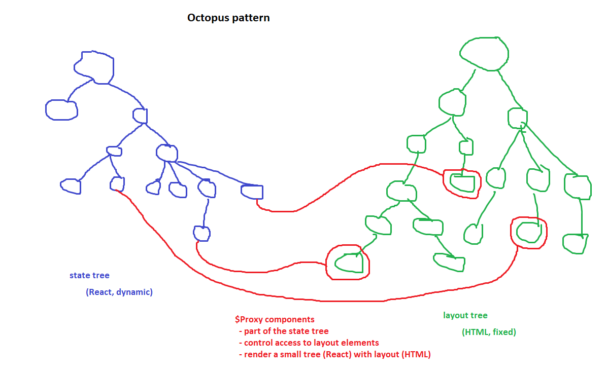
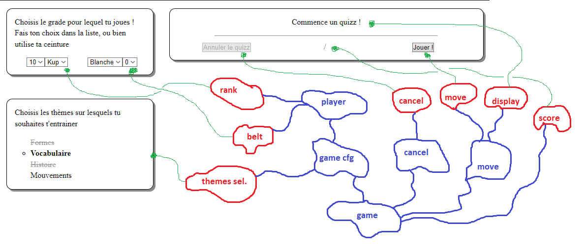
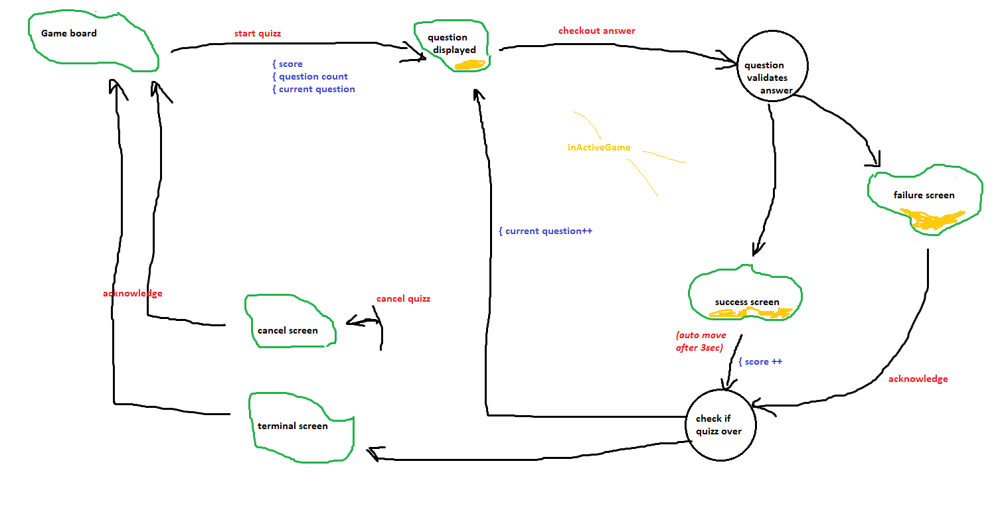

# File organisation

## `ReactOctopusPattern`

This file contains what's required to implement the base pattern we're using.

## `soobahkdo`

This file contains business logic related to Soo Bahk Do as such (ranks, belts, ...).
It is likely that this file will end up being auto-generated by the Java engine.

## `stateTree`

This file contains the entire tree of state for the application.

The logic behind the automaton that controls the quizz, is described here:

## `index` 

This file orchestrates dependencies and sets up the static layout.
For now, it also contains styles.

